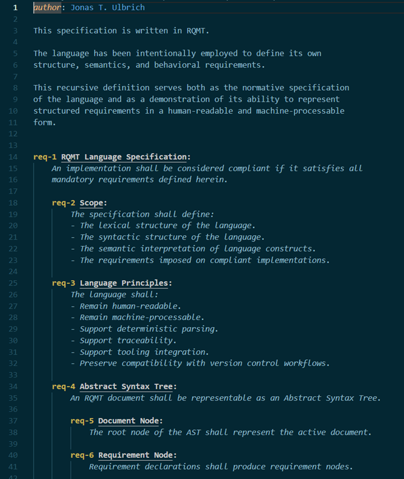

# RQMT

> Structure is not a guideline; it is an agreement. The value of a language lies not in the freedom it provides, but in the ambiguity it removes.

**Requirements as Code for Systems Engineering**

RQMT is an open-source framework for writing, validating, and managing requirements using a structured language designed for both humans and machines.

The project is built around the idea that requirements should be treated similarly to source code:

- Written in a formal syntax
- Parsed into an Abstract Syntax Tree (AST)
- Validated automatically
- Version controlled with Git
- Supported by IDE tooling
- Traceable across development artifacts

RQMT aims to bridge the gap between stakeholders, systems engineers, and developers through a common, machine-processable representation of requirements.

---

## Why RQMT?

Requirements are often written as free-form documents.

While this approach is flexible, it introduces several challenges:

- Ambiguity
- Inconsistent structure
- Difficult traceability
- Limited automation
- Poor integration with development workflows

Modern software development benefits from compilers, static analysis, IDEs, and automated tooling.

RQMT applies similar principles to requirements engineering.

---

## Development Setup

### Prerequisites

- Node.js
- CMake
- A C++ compiler
- VS Code (recommended)

### Installation

```bash
npm install
npm run compile
```

### Build

Use the VS Code CMake extension or:

```bash
cmake -S server/src -B build
cmake --build build
```

---

## Example

```rqmt
req-1 User Authentication:
    [to_implement]
    The system shall authenticate users before granting access.

    fr{login}-2 Login:
        The system shall provide a login interface.

    @draft
    nfr-3 Security:
        Authentication credentials shall be stored securely.
```

The document can be parsed into a structured representation:

```text
Document
└─ req-1 User Authentication
   ├─ fr-2 Login
   └─ nfr-3 Security
```

---

## Core Concepts

### Structured Requirements

Requirements are written using a simple hierarchical syntax.

```rqmt
req-10 Navigation:
    The robot shall navigate autonomously.

    fr-11 Localization:
        The robot shall estimate its position.
```

### Abstract Syntax Tree (AST)

RQMT documents are parsed into an AST that can be analyzed and processed automatically.

### Requirements as Code

Requirements become machine-processable artifacts that can participate in development workflows.

### Traceability

RQMT is designed with traceability in mind.

Requirements can be uniquely identified, referenced, validated, and linked to:

- Requirements
- Design artifacts
- Source code
- Test cases
- Documentation

---

## Architecture

```text
RQMT Document
        │
        ▼
     Lexer
        │
        ▼
     Parser
        │
        ▼
       AST
        │
        ├── Diagnostics
        ├── Validation
        ├── Traceability
        └── Tooling
```

---

## Motivation

RQMT was originally motivated by the challenges of systems engineering in multidisciplinary domains such as robotics, where requirements often serve as the primary interface between:

- Stakeholders
- Systems engineers
- Software engineers
- Mechanical engineers
- Electrical engineers
- Verification and validation teams

RQMT provides a common, easy to learn, structured representation that can be understood by humans and processed by tools. 

---

## Status

RQMT is currently in active development, in an early stage. The language specification and tooling are evolving and may change significantly before the first stable release.

### Proof of Concept
**Version: 0.1.0.x**

A rudimentary implementation of the LSP can be run as VSC extension:



Implemented:
- Lexer
- Parser
- AST generation
- Incremental parsing
- Syntax diagnostics
- Semantic tokens and syntax high-lighting
- Go-to-definition `reference` &rarr; `alias`

In progress:
- Semantic diagnostics
- Auto-completion
- Automatic ID generation

## Roadmap

### v0.2: Core Semantics

- Reference resolution 
- Semantic diagnostics 
- Alias validation
- Tag syntax
- Decorators syntax
- Link tests and implementations

### v0.3: Modularity and Usability

- Cross-file references
- Workspace indexing
- Auto-ID workflow
- Hover information
- Formatting

### v0.4: Advanced Tooling

- Workspace indexing (optimized)
- Rename symbol
- Traceability views
- Export to Markdown/HTML
- Configuration files (.rqmtconfig.json)

### v0.5: Automation and CI/CD

- CI/CD Integration
- Static Analysis (CLI: rqmt lint)
- Flags: blocking releases, draft
- Basic AI-assisted analysis (ambiguity, completeness)

### v0.6: AI for Content

- AI-assisted analysis (conflicts, standards compliance)
- Collaborative review tools (GitHub/GitLab integration)

### v0.7: Advanced AI and Collaboration

- AI for domain-specific checks (e.g., ISO 26262 compliance)
- Plugin system (custom rules/checks)

### v1.0: Stability and Production

- Stable language specification
- Complete LSP support
- Production-ready tooling

## Documentation

- [language.md](docs/language.md)
- [specification.rqmt](docs/specification.rqmt)
- [grammar.md](docs/grammar.md)

---

## Contributing

Contributions, feedback, discussions, and feature requests are welcome.

---

## License

MIT License